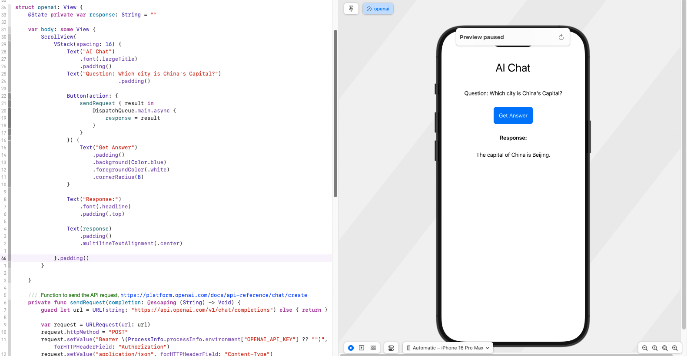

# OpenAI and Prompt Engineering

play with OpenAI's REST API/LLaMa using different SDK or HTTP Requests. Mostly, I will use the Official Python SDK to test all engineering ideas. And I will design playfully the UI and API state management through SwiftUI projects.

**branch - features**
```bash
  JavaScriptSDK
  SwiftSDK
* main
  pythonSDK
  swift
(END)
```

- [MacPaw/OpenAI](https://github.com/MacPaw/OpenAI.git)
- [LLaMA](https://www.llama.com)
 * [ollama](https://ollama.com)
  * [open-webui](https://github.com/open-webui/open-webui.git)

## Some thoughts 

- Criticize/Crave/Cultivate LLM.
- Designing/Developing/Deploying LLM.

### about LLM API

- Clearly think through the specific job. Identify strategy first then choose the right tactic.
 * Engineer the System Message for completion logics (knowledge).
 * Engineer the Assistant Message for Styling and formatting the completion.
 * Engineer the User Message for stating the Target.
- Use LLM API in a modulized way.
 * model the job to generate sufficient information of Prompt Engineering.
 * model the prompt engineering to digest the job-model output into prompts. 
 * model the calls of API to sent requests and get response.
 * model the stage of using API and UI. (a view model in case of SwiftUI)

### about LLM scope

- Complex Context: LLM cannot be relied upon to perform arithmetic or long calculations accurately on their own[1].
 * Given the inference/reasoning capability is still unreliable, if any complex logic is required to derive the pre-result, we should write external programs(human reasoning) to offer the pre-result information. For example, given the date of birth, the accurate calculation of lunarCalendar date, BaZi, ZiWei Natal Chart, and fundamental theory/rule of interpretation should be prepared before prompt engineering.
 * For accurate inference-based job, we can only let LLM do the creative part or summarization of large corps of inference result,
 * In a nutshell, all prediction model is always not inference model, we make prediction more accurate to fool people with a spurious inference just like statistical inference.
- Large Context make LLM lose accuracy.
 * AI models have token limits, meaning they can only remember a certain amount of text within a single conversation.

### about LLM development

- Data preparation 
 * LLM is never too big to be specific to some extend.
 * Prepare gold-standard labeled data for better LLM prediction accuracy.


## OpenAI Python SDK

`from openai import OpenAI`

The Python SDK (openai package) abstracts API calls, providing convenient functions like `chat.completions.create` You simply specify parameters, and the SDK handles request setup, error handling, and parsing.

## SwiftUI HTTP requests

Swift does not have an official OpenAI SDK, so you use native networking tools like `URLSession` to manually set up and send HTTP requests. This requires additional steps to construct the request, add headers, serialize data into JSON, and parse responses manually.

- `Info.plist`: 

```xml
<?xml version="1.0" encoding="UTF-8"?>
<!DOCTYPE plist PUBLIC "-//Apple//DTD PLIST 1.0//EN" "http://www.apple.com/DTDs/PropertyList-1.0.dtd">
<plist version="1.0">
<dict>
	<key>NSAppTransportSecurity</key>
	<dict>
		<key>NSAllowsArbitraryLoads</key>
		<true/>
	</dict>
</dict>
</plist>
```
>In iOS, secure storage of sensitive data (like API keys) requires handling through Keychain, .plist files (in development), or scheme's environment variables configured in Xcode, which adds complexity.



>Swift heavily uses async calls for network operations, typically requiring `DispatchQueue.main.async` to update UI from background tasks. 

## References

- [openAI-guide](https://platform.openai.com/docs/overview)
- [Embeddings](https://platform.openai.com/docs/guides/embeddings)
- [api-reference](https://platform.openai.com/docs/api-reference/introduction)

[1]: [Tactic: Use code execution to perform more accurate calculations or call external APIs](https://platform.openai.com/docs/guides/prompt-engineering/tactic-use-code-execution-to-perform-more-accurate-calculations-or-call-external-apis)
